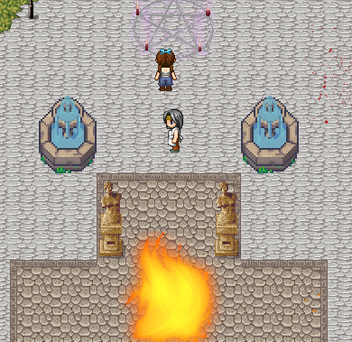
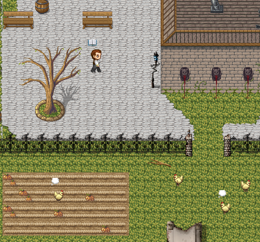
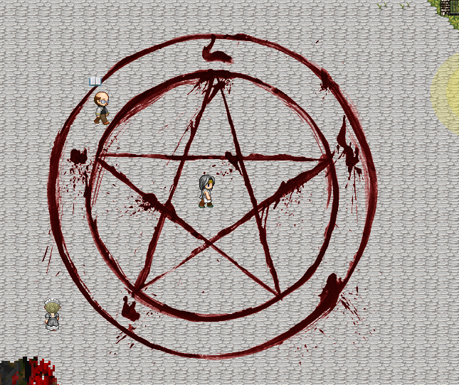
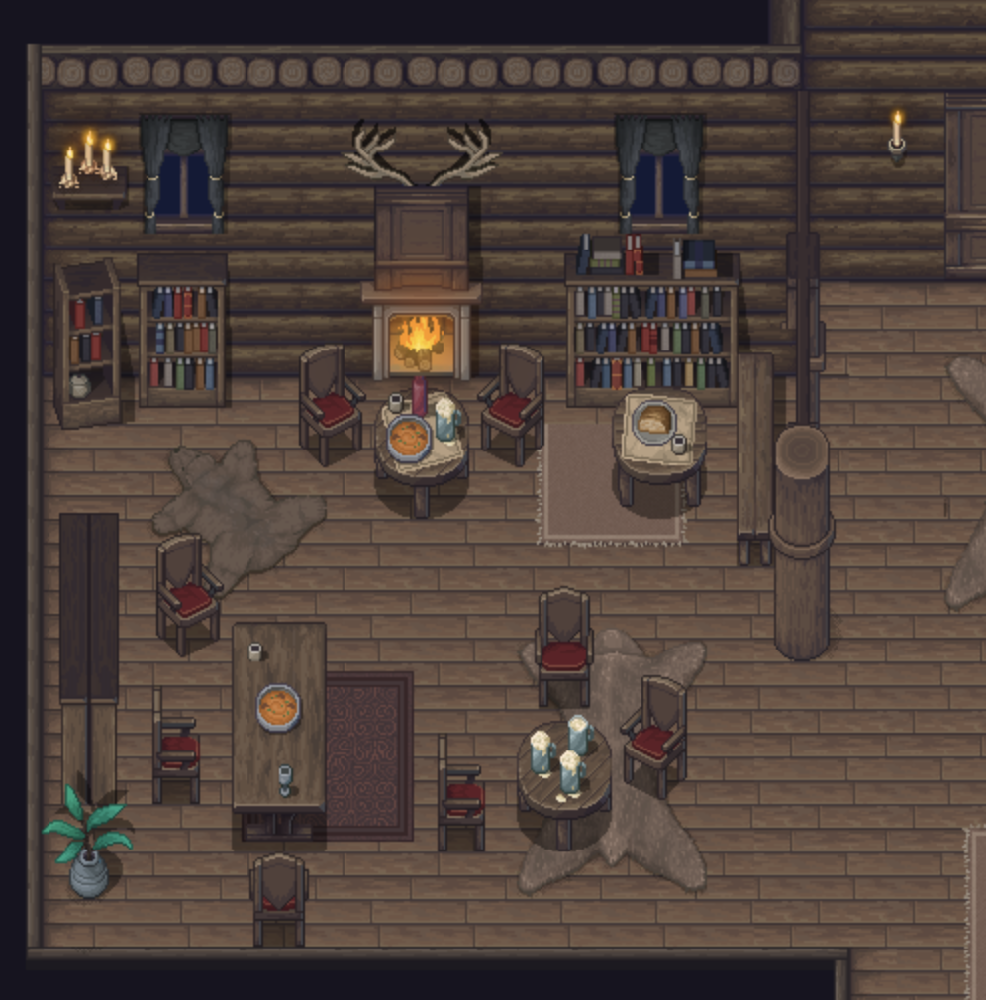
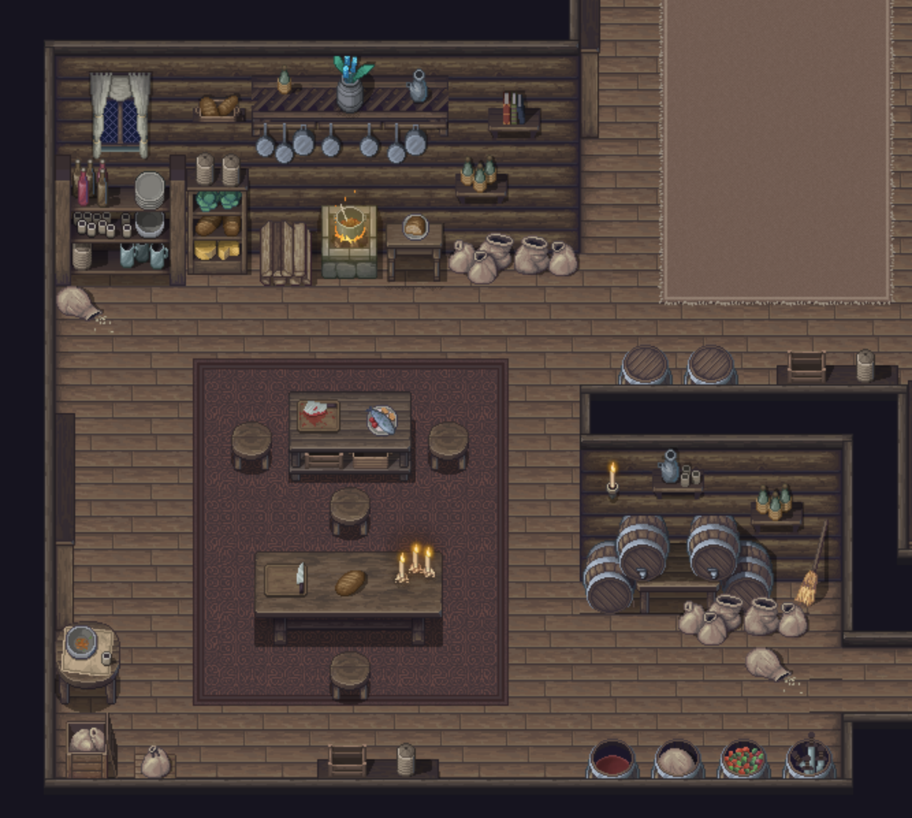
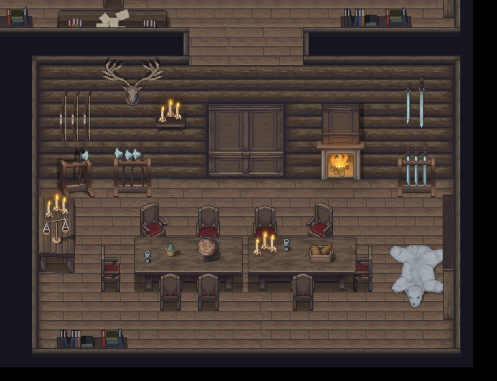

<br>

# tiny-spaces

Tiny spaces is a minimal javascript engine for building retro 2D games with AI
as a core component of the game logic. It has minimal dependencies (pixi.js for
graphics, and Braintrust for AI model integration) and is built to run fully in
the browser.

The project contains spaced -- the game engine (basic tiling, character and leval mechanics), mapped -- a basic, in browser level editor, sprited -- a basic, in browser sprite editor, and a few demos including a minimal port of the start of Phantasy Star 1 for the Sega Master System using the original tile set.  

Tiny spaces is intentionally minimal to have a very low barrier to entry, and to
be as general as possible. Therefore there is no auth support, and no back end
state management. 

## Quick Start:

```
npm install
npm run dev
```

Point your browser at the running server (e.g. http://localhost:5173/) and click on the link called **Mage**. You should see a basic level, with music and no characters. 


The code for mage is in [src/games/mage/](src/games/mage/).

## Penta



Penta is a demo game where the main character walks around a cursed town trying
to figure out what is going on, and eventually remove the curse. It's largely an
experiement in using LLMs as a key part of gameplay. 

If you're interested in building on **Tiny Spaces** this is a good place to start.

Docs for Penta can be found at [Penta](src/games/penta/README.md).

## SpaceD

SpaceD is a super minimal game engine for building AI enabled, javascript rpgs and interactive fiction entirely in the browser. 

Documentation can be found in [spaced docs](src/spaced/README.md)

## Map Editor

Documentation can be found in [map editor](src/mapped/README.md)    

## Sprite Editor

Documentation can be found in [sprite editor](src/sprited/README.md)

## Phantasy Star 1

**(Warning: PS1 is under development and likely broken at any given time)**

Documentation can be found in [Phantasy Star 1](src/games/ps1/README.md)

## Screenshots

      