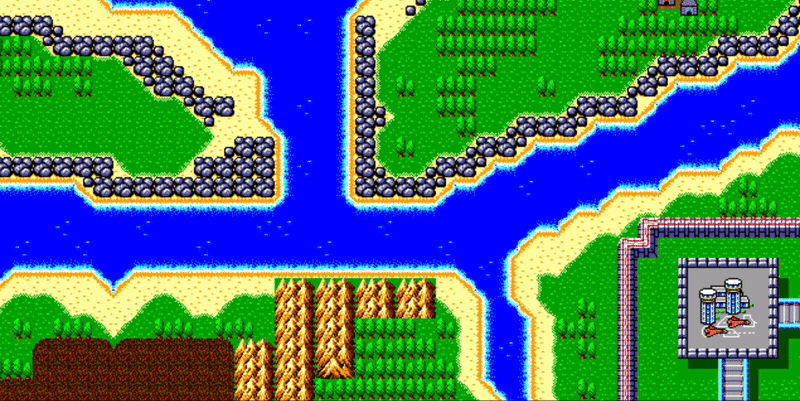
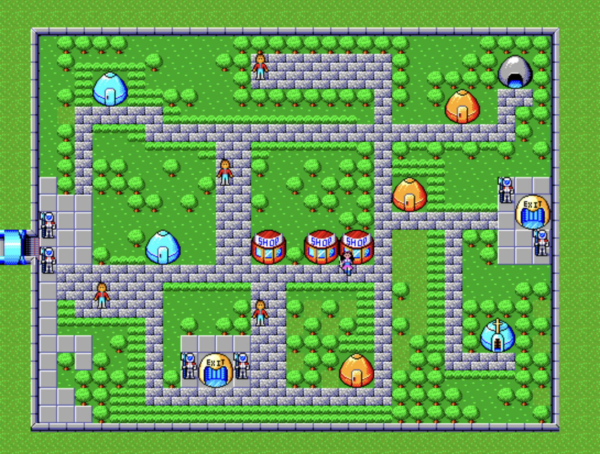
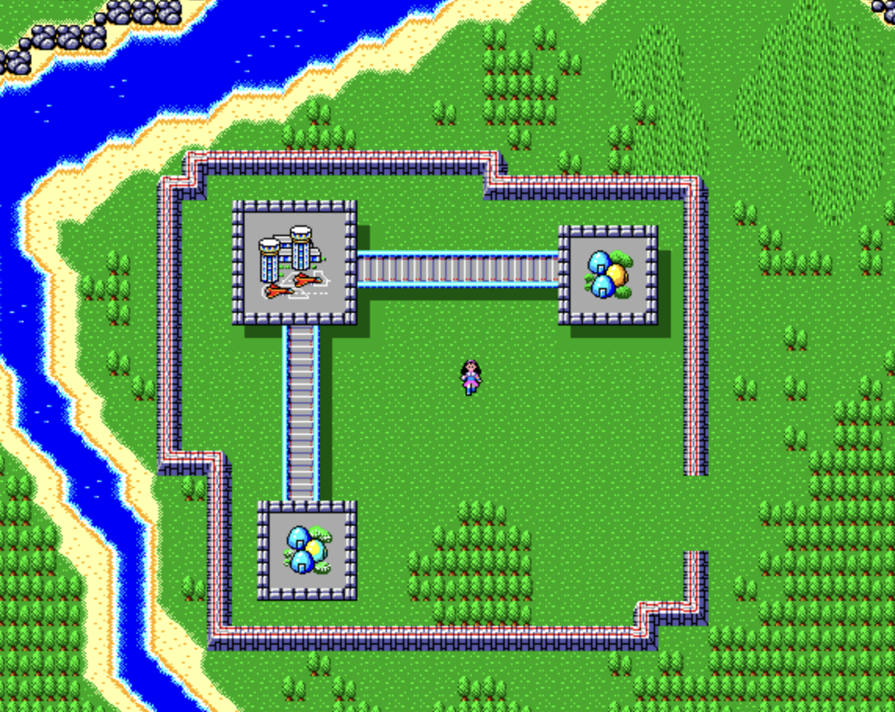
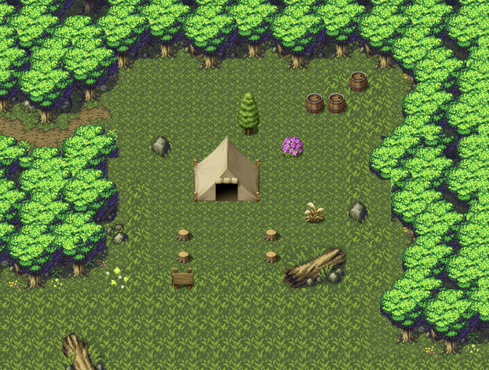
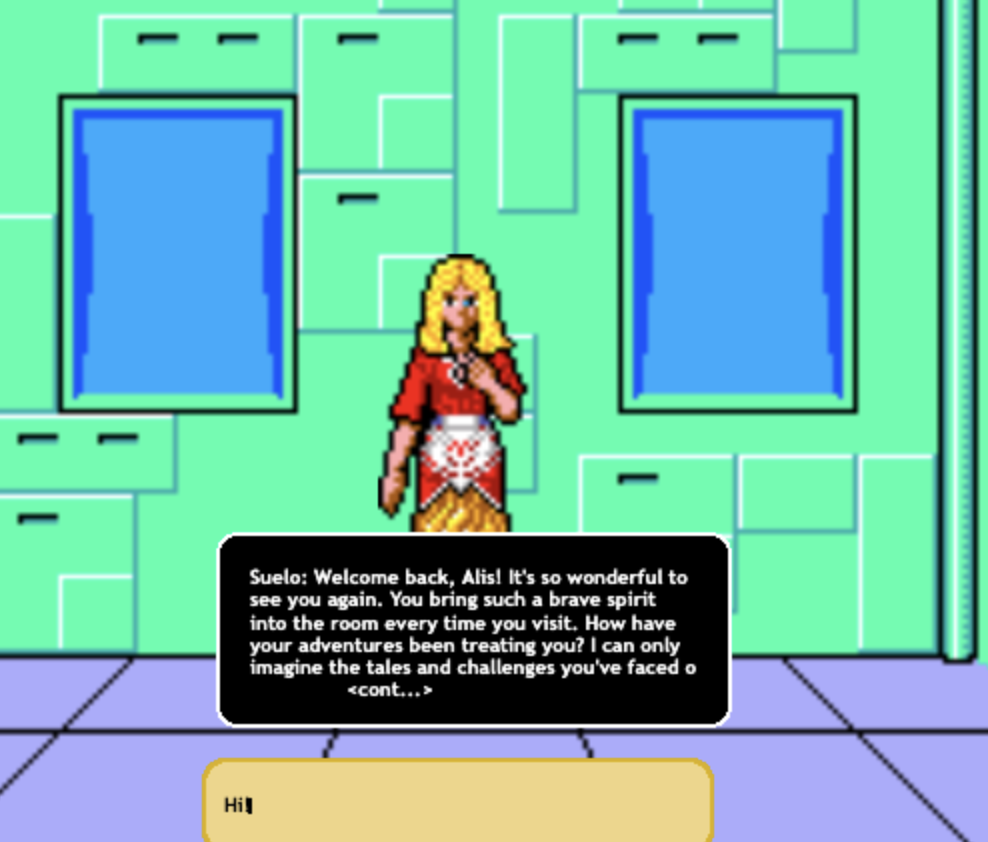
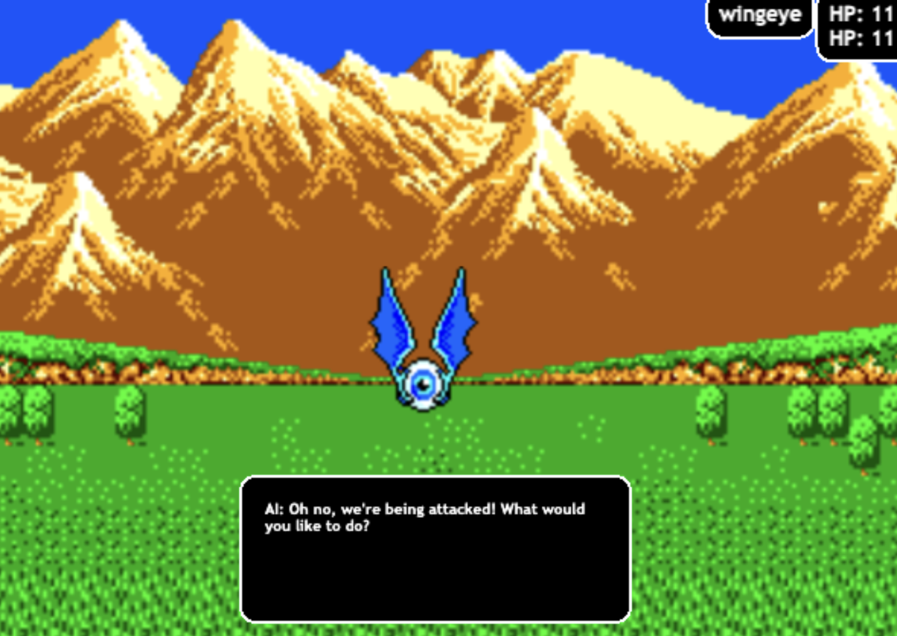
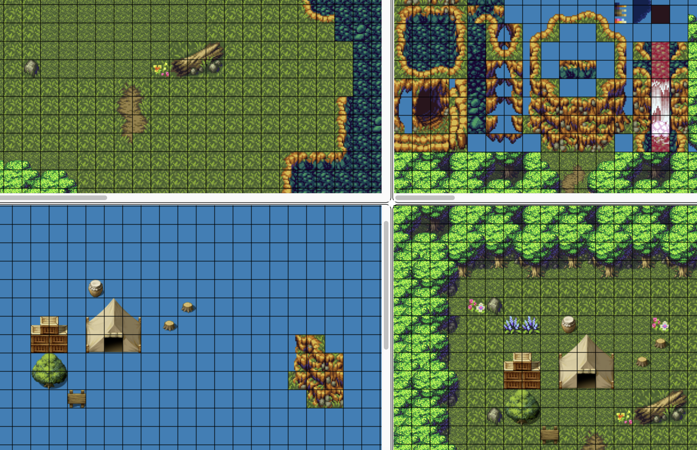
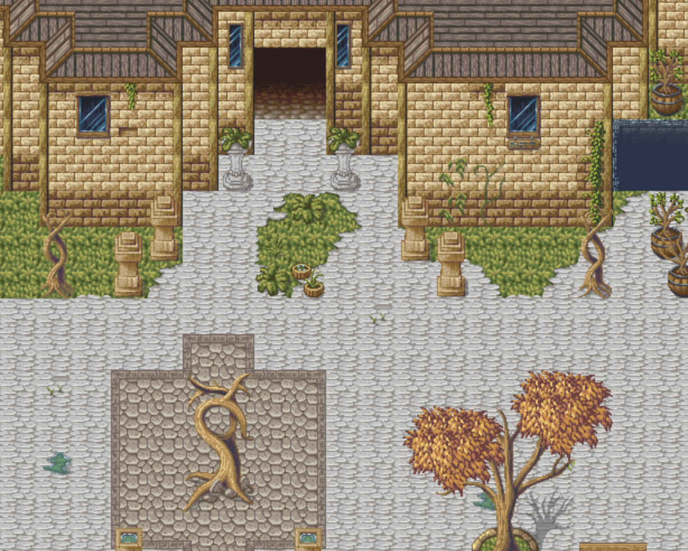
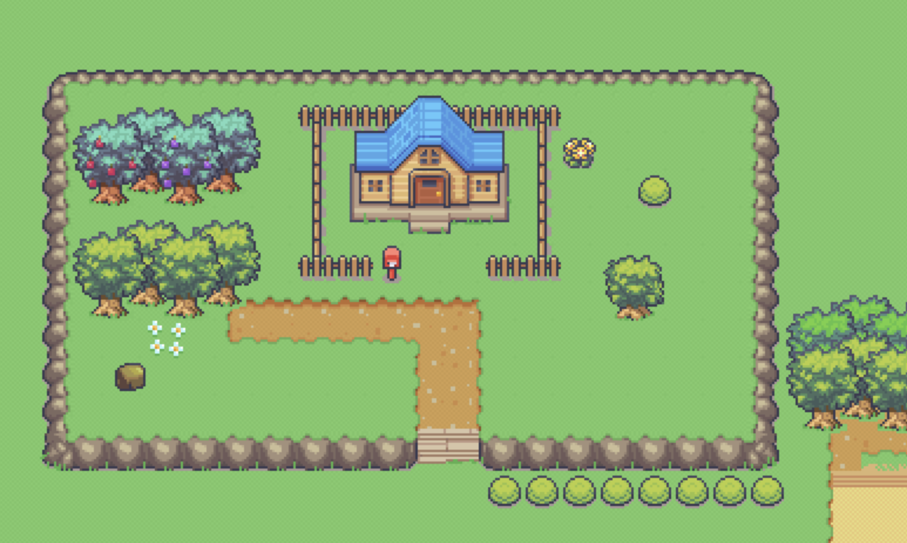
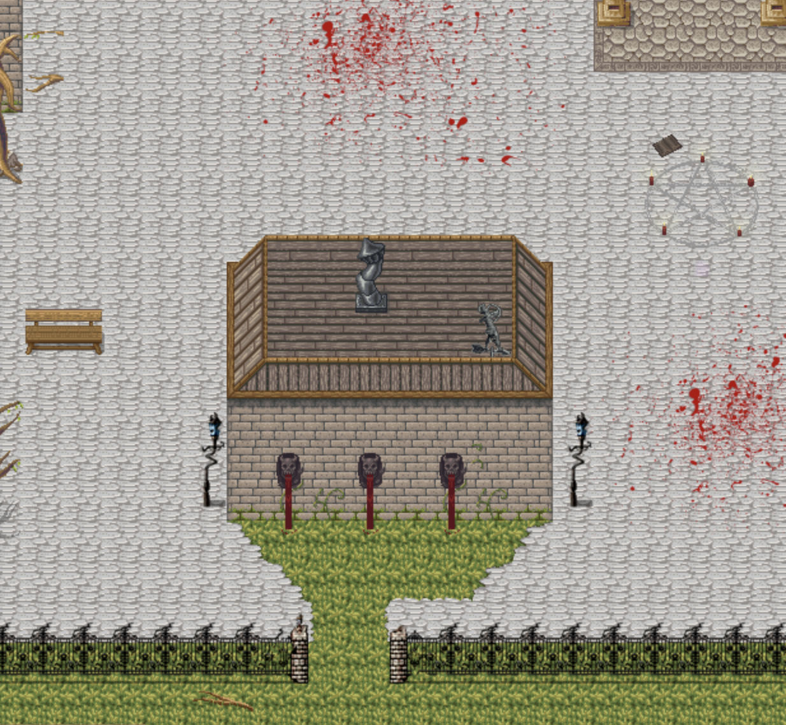

<br>

# tiny-spaces

Tiny spaces is a minimal javascript game engine for building 2D rpgs and interactive fiction. It has a basic level editor, a sprite editor, a tiling engine, and a very very basic game engine. 

Tiny spaces was built to support a port of the original Phantasy Star 1 game for the Sega Master System and to integrate AI/LLMs into the gameplay.  

It has been intentionally kept minimal to have a very low barrier to entry, and to be as general as possible. Therefore there is no auth support, and no back end state management. 

## Quick Start:

```
npm install
npm run dev
```

Point your browser at the running server and you can click into the sprite editer, map editer, or Phantasy Star 1 as an example game built with tiny spaces.

## SpaceD

SpaceD is a super minimal game engine for building javascript based rpgs and interactive fiction. 

Documentation can be found in [spaced docs](src/spaced/README.md)

## Map Editor

Documentation can be found in [map editor](src/mapped/README.md)    

## Sprite Editor

Documentation can be found in [sprite editor](src/sprited/README.md)

## Phantasy Star 1

Documentation can be found in [Phantasy Star 1](src/games/ps1/README.md)

## Screenshots

      