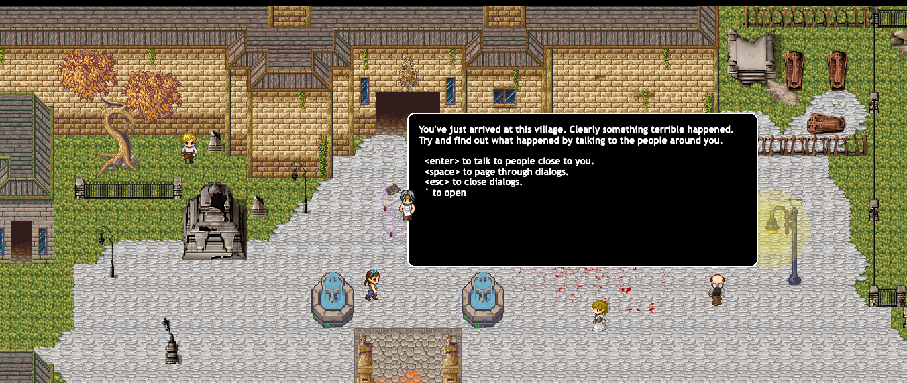

<br>
# Penta

Penta is a demo game built on tiny-spaces that is a bit of an experiment to integrate LLMs into gameplay. In the game, the character is a new arrival to a cursed town and needs to talk to the townspeople to figure out what is going on and how to fix it. 

The game runs entirely in browser and the only dependencies are Braintrust and Pixi.js. 

## Quick Start

To run Penta, you'll need a [Braintrust](https://www.braintrust.dev/) account that has one or more LLMs configured (I generally test with Grok 2 and gtp-4o). Given that the steps are simple:

- First you'll have to push to prompts to braintrust. The prompts are in [braintrust/pentacity.ts](braintrust/pentacity.ts). To do so issue the following command from the tiny spaces root directory:
```
export BRAINTRUST_API_KEY="..."
npx braintrust push braintrust/pentacity.ts  --if-exists replace
```
- This should create a project in Braintrust called pentacity. Go to library->prompts. And check out the prompts. You'll want to specify the model to use for each. 
- Next simply run from the game directory, point your browser to the local URL, and click on **Penta**.
```
cd src/games/penta/
npm run dev
```
